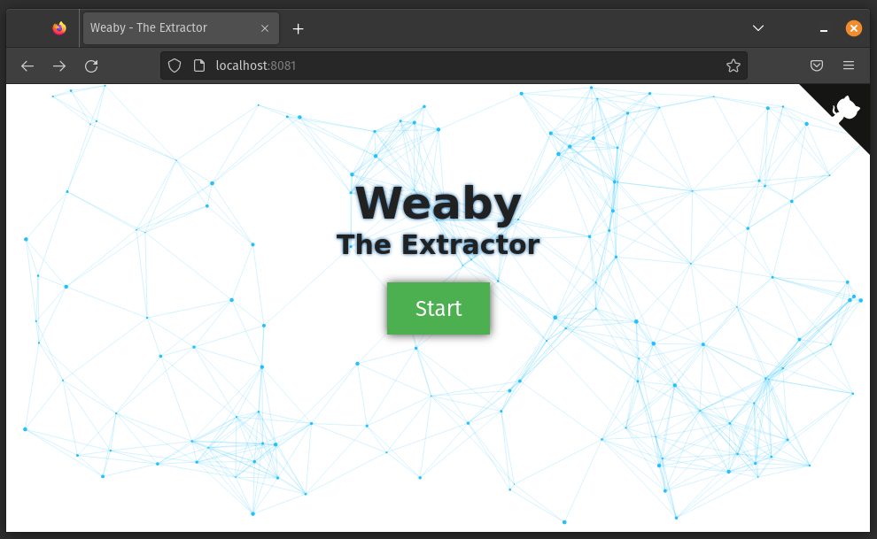

# Weaby the Extractor


**Weaby** is a program that can collect data from multiple websites. It is developed using [FastAPI](https://fastapi.tiangolo.com/) and extracts data from websites using **Selenium**. The project is containerized using **Docker Compose**. [Undetected Chrome Driver](https://github.com/ultrafunkamsterdam/undetected-chromedriver) within the project downloads the most recent version of Chrome Driver to support the current Chrome version, which is installed by the **Docker**.

## Installation

### Docker
To install the project, you need to have **Python 3**, **Docker** and **Docker Compose** installed on your machine. You can download Python from [here](https://www.python.org/downloads/), Docker from [here](https://www.docker.com/products/docker-desktop) and Docker Compose from [here](https://docs.docker.com/compose/install/).

### Project
After installing Docker and Docker Compose, you can clone the project by running the following command:

```bash
git clone https://github.com/arman-bd/weaby-the-extractor.git
```

### Environment

After cloning the project, you need to create a **.env** file in the project directory. You can copy the **.env.example** file and rename it to **.env**. 

```bash
cp .env.example .env
```

You may change the **.env** file according to your needs. To change the **.env** file, open it with a text editor and change the values of the variables.

## Usage

Run the following command to start the project:

```bash
docker compose up --build -d
```

After running the command, you can access the project by visiting **http://localhost:8081** in your browser.



## Supported Websites

Currently, the **Weaby** supports the following websites for data extraction:

- [YouTube](https://www.youtube.com/)
- [Wikipedia](https://www.wikipedia.org/)
- [Google Play Store](https://play.google.com/store)

### Adding Support for a Website

To add support for a website, you need to follow the steps below:

1. Create a Service Method in **app/services/extract.py**.

```python
async def website_data(driver: uc.Chrome, id: str, wait: int = 5):
    driver.get(f"https://YOUR_WEBSITE_HERE/{id}")
    time.sleep(wait)
    title = driver.find_element(By.XPATH, "/html/body/div[3]/h1/span").text
    description = driver.find_element(By.XPATH, "/html/body/div[3]/div[3]/div[5]/div[1]/p[2]").text
    return {
        "title": title,
        "description": description
    }
```

2. Create a Controller Method in **app/controllers/extract.py**.

```python
async def website_data(id: str):
    try:
        driver = wd.create_driver()
        return await ExtractService.website_data(driver, id, 5)
    except Exception as e:
        return {"error": str(e)}
```

3. Create a Router Method in **app/routers/extract.py**.

```python
@router.get("/website/{id}", response_model=WebsiteData)
async def website_data(id: str):
    return await ExtractController.website_data(id)
```

Now you can access the data from the website by sending a **GET** request to **http://localhost:8081/extract/website/{id}**.

## Weaby in Action


## Disclaimer

The project is still in development and is not ready for production. The project is not tested thoroughly and may contain bugs. It is designed to be used for educational purposes only. The very purpose of this project is to demonstrate how to use Selenium to interact with a websites. Use at your own risk. I am not responsible for any misuse of this project.

## License

This project is licensed under the MIT License - see the [LICENSE](LICENSE) file for details.

## Acknowledgments

* [Undetected Chrome Driver](https://github.com/ultrafunkamsterdam/undetected-chromedriver)
* [Docker](https://www.docker.com/)
* [MongoDB](https://www.mongodb.com/)
* [Selenium](https://www.selenium.dev/)
* [FastAPI](https://fastapi.tiangolo.com/)


